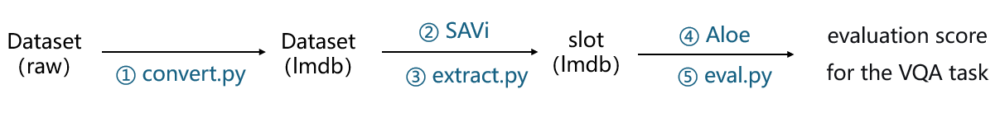

# Project Overview
**This is a replication project of Aloe** ( Attention over learned object embeddings enables complex visual reasoning ) . Prior to this work, Aloe existed in two versions ([the original Aloe](https://github.com/google-deepmind/deepmind-research/tree/master/object_attention_for_reasoning) and [Aloe from SlotFormer](https://github.com/pairlab/SlotFormer)), and we are replicating the latter.

<br>

|     | Framework | OCL backbone | mask-object prediction loss | VQA Transformer layers |
|-----|----------|------------------------|------------------------|-----|
| aloe |     TensorFlow     | MONet| True        |           28              |
| aloe* | PyTorch      | SAVi  | False          |               12         |

*Table 1. **Summary of changes** : Original Aloe ( aloe ) vs  SlotFormer Aloe ( aloe\* )*     

<br>
<br>

|        | SAVi (Train) | SAVi (Val) | VQA Transformer (Train) | VQA Transformer (Val) |
|--------|--------------|------------|-------------------------|-----------------------|
| aloe*  | enumeration  | enumeration | random                    | **random**               |
| aloe** | enumeration  | enumeration | random                  | **fixed median**      |

*Table 2. **Summary of changes** : SlotFormer Aloe ( aloe\* ) vs  Ours ( aloe\*\* ) , where their only difference lies in the **video starting frame sampling method** ( enumeration, random or fixed median )*
<br>
<br>
<br>
(1) **enumeration : A data expansion strategy.** Every valid starting position is pre-materialized as an independent dataset entry. For a video of length $L$ with clip length $T$ and stride $S$, this yields $L-(T-1)S$ entries per video which is the count of valid start indices. This expands the effective dataset size and guarantees that every possible temporal offset of each video is seen exactly once per epoch.
<br>
<br>
(2) **random : A temporal data augmentation strategy.** Instead of expanding every valid start position into a separate dataset entry, just one position is randomly selected as the entry. For a video of length $L$ with clip length $T$ and stride $S$, there are $L-(T-1)S$ possible start positions, but unlike enumeration only one is chosen per access rather than expanding all possibilities into entries. During training, this acts as temporal data augmentation — the same video may appear at a different offset every epoch, encouraging temporal shift invariance and improving robustness.
<br>
<br>
(3) **fixed median : An uncertainty-control strategy for validation.** Our main modification relative to SlotFormer Aloe. While training uses random sampling, validation instead always selects the median of the valid range as the starting position. A fixed starting point produces strictly deterministic and reproducible results during validation. It also avoids edge frames near video boundaries — where objects may not yet have entered or may have already exited — offering a fairer assessment than arbitrary offsets.
<br>
<br>
<br>

|                           | Descriptive | Explanatory | Predictive | Counterfactual |
|---------------------------|-------------|-------------|------------|----------------|
| aloe (test)               | 94          | 96          | 87.5       | 75.6           |
| aloe* (test)              | –           | –           | 87.3       | –              |
| aloe* + slotformer (test) | 95.2        | 94.8        | 93.3       | 73.8           |
| aloe* (val)               | 95.0        | 93.9        | 85.4       | 73.9           |
| aloe** (val)              | 95.0        | 93.0        | 85.3       | 72.9           |

*Table 3. **Performance** (per question accuracy) of Original Aloe (aloe), SlotFormer Aloe (aloe\*), and Ours (aloe\*\*) on different question types on the CLEVRER val set or test set with a batch size of 256. Numbers are in %.*
<br>
<br>
**Note** : As of January 17, 2026, the CLEVRER [official website](http://clevrer.csail.mit.edu/) and [third-party hosts](https://eval.ai/web/challenges/challenge-page/667/leaderboard/1813) have completely **stopped providing evaluation services for the test set of the CLEVRER dataset**. Therefore, we will use its **validation set** as the subsequent benchmark. **The first three rows** in the *Table 3* are results obtained from published papers, all of which are evaluated on the test set. **The second-to-last row** shows the results we obtained on the validation set by strictly following the instructions of SlotFormer. **The last row** presents our results on the validation set.
<br>
<br>
# Environment
We provide an `environment.yml` file that can be used to install the required packages in a conda environment, you can install and activate it by using the following commands：

```text
conda env create -f environment.yml 
conda activate aloe
```
<br>

# Converted Datasets
Datasets CLEVRER, which is converted into LMDB format and can be used off-the-shelf, are available as [releases](https://github.com/ExpressStag001/Aloe_reproduction/releases)：
<br>
- [clevrer](https://github.com/ExpressStag001/Aloe_reproduction/releases/tag/clevrer) ：converted dataset from [CLEVRER](http://clevrer.csail.mit.edu/).
<br>
<br>

# Pre-trained 
The pre-trained model weights, training logs (random seeds 42) and pre-generated slots  are available as [releases]().

- [archive-savi](https://github.com/ExpressStag001/Aloe_reproduction/releases/tag/archive-savi) : **Pre-trained SAVI** on CLEVRER. The SAVI model is responsible for **extracting slot** features from images or videos which will be used in downstream VQA tasks.
- [archive-aloe](https://github.com/ExpressStag001/Aloe_reproduction/releases/tag/archive-aloe) : **Pre-trained ALOE** on CLEVRER. The ALOE model **predicts VQA answers** using upstream‑extracted slots.
- [SLOT-savi-clevrer_video](https://github.com/ExpressStag001/Aloe_reproduction/releases/tag/SLOT-savi-clevrer_video) : **Pre-generated slot features** extracted from CLEVRER videos using the pre-trained SAVI model we provid with the `savi-clevrer_video` config.

<br>
<br>

# Project Pipeline

<br>
<br>
## ① Convert the format of the dataset

Download the raw dataset and organize it into the following structure :
```text
./datasets/clevrer_raw/
├── videos/
│   ├── train/
│   │   ├── video_00000-01000/
│   │   │   ├── video_00000.mp4
│   │   │   ├── video_00001.mp4
│   │   │   ├── ...
│   │   │   └── video_00999.mp4
│   │   ├── video_01000-02000/
│   │   ├── ...
│   │   └── video_09000-10000/
│   │
│   ├── val/
│   │   ├── video_10000-11000/
│   │   ├── ...
│   │   └── video_14000-15000/
│   │
│   └── test/
│       ├── video_15000-16000/
│       ├── ...
│       └── video_19000-20000/
│
├── questions/
│   ├── train.json
│   ├── val.json
│   └── test.json
│
└── derender_proposals/
    ├── proposal_00000.json
    ├── proposal_00001.json
    ├── ...
    └── proposal_19999.json
```

then convert to LMDB format. For example, run :
```text
python convert.py \
    --dataset clevrer \
    --src_dir ./datasets/clevrer_raw \
    --dst_dir ./datasets/clevrer
```
Alternatively, you can use the off-the-shelf converted datasets (see the *Converted Datasets* section). Download and extract them to `datasets/clevrer`, which should contain `train.lmdb`, `val.lmdb`, `test.lmdb`, and `vocab.json` (word-to-index mappings for tokenizing questions and answers from SlotFormer).
<br>
<br>
## ② Train the Savi model
```text
python train.py \
    --seed 42 \
    --cfg_file config-savi/savi-clevrer_video.py \
    --data_dir ./datasets \
    --save_dir archive-savi
```
We also provide the trained SAVI model parameters in the *Pre‑trained* section. Download and extract the `archive-savi` to the root directory of this project. You will then find the pre‑trained model parameters at `archive-savi/savi-clevrer_video/42_ckpt/0011.pth`.
<br>
<br>
## ③ Extract slot features

Use the trained SAVI model to extract the dataset from pixel images into slot features. For example, run :
```text
python extract.py \
    --cfg_file archive-savi/savi-clevrer_video/savi-clevrer_video.py \
    --ckpt_file archive-savi/savi-clevrer_video/42_ckpt/0011.pth \
    --data_dir ./datasets
```
Alternatively, you can use the off-the-shelf generated slots. Please refer to the *Pre‑trained* section, download them and place at `datasets/clevrer/SLOT-savi-clevrer_video`
<br>
<br>
## ④ Train the Aloe model
```text
python train.py \
    --seed 42 \
    --cfg_file config-aloe/aloe-clevrer_vqa_slots.py \
    --data_dir ./datasets \
    --save_dir archive-aloe
```
We also provide the trained Aloe model parameters in the *Pre‑trained* section. Download and extract the `archive-aloe` to the root directory of this project. You will then find the pre‑trained model parameters at `archive-aloe/aloe-clevrer_vqa_slots/42_ckpt/0392.pth`.

<br>
<br>

## ⑤ Evaluate the model
The SAVI model is evaluated using the image segmentation metrics ARI, ARI<sub>fg</sub>, MBO, and MIOU.
```text
python eval.py \
    --cfg_file archive-savi/savi-clevrer_video/savi-clevrer_video.py \
    --ckpt_file archive-savi/savi-clevrer_video/42_ckpt/0011.pth \
    --data_dir ./datasets
```
The Aloe model is evaluated via accuracy on four question types: Descriptive, Explanatory, Predictive, and Counterfactual.
```text
python eval.py \
    --cfg_file archive-aloe/aloe-clevrer_vqa_slots/aloe-clevrer_vqa_slots.py \
    --ckpt_file archive-aloe/aloe-clevrer_vqa_slots/42_ckpt/0392.pth \
    --data_dir ./datasets
```
